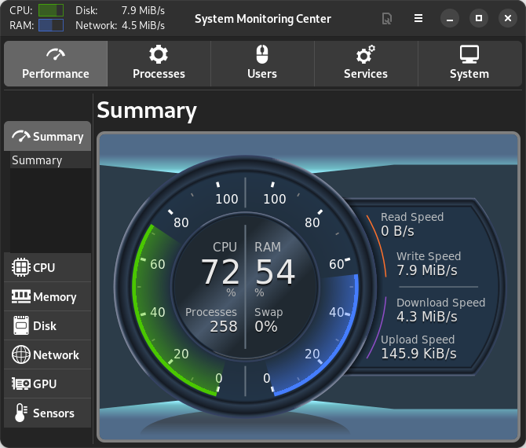
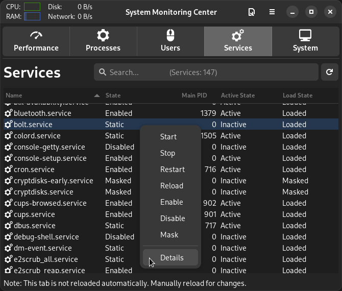
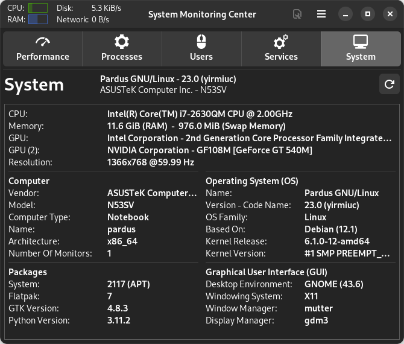

# System Monitoring Center

<p align="center">
    
</p>


<p align="center">
    <strong>
        Multi-featured system monitor.
    </strong>
</p>


<p align="center">
    <a href="https://github.com/hakandundar34coding/system-monitoring-center/tags">
        
    </a>
    <a href="https://github.com/hakandundar34coding/system-monitoring-center/tags">
        
    </a>
    <a href="https://github.com/hakandundar34coding/system-monitoring-center/tags">
        
    </a>
    <a href="https://pypi.org/project/system-monitoring-center/">
        
    </a>
    <a href="https://flathub.org/apps/details/io.github.hakandundar34coding.system-monitoring-center">
        
    </a>
    <a href="https://github.com/hakandundar34coding/system-monitoring-center/blob/master/Changes.md">
        
    </a>
</p>


<p align="center">
    <a href="https://github.com/hakandundar34coding/system-monitoring-center/tags">
        
    </a>
    <a href="https://github.com/hakandundar34coding/system-monitoring-center/tags">
        
    </a>
</p>


<p align="center">
    <strong>
        Translations:
    </strong>
    Czech | German | English | Persian | Hungarian | Polish | Portuguese (Brazilian) | Portuguese(European) | Russian | Turkish | Chinese (Simplified)
</p>


<p align="center">
    <a href='https://pypi.org/project/system-monitoring-center'>
        
    </a>
    <a href='https://flathub.org/apps/details/io.github.hakandundar34coding.system-monitoring-center'>
        
    </a>
    <a href='https://apps.pardus.org.tr/app/system-monitoring-center'>
        
    </a>
    <a href='https://github.com/Botspot/pi-apps'>
        
    </a>
</p>


<p align="center">
    <a href="https://repology.org/project/system-monitoring-center/versions">
        
    </a>
</p>


### Features:
- Detailed system performance and usage usage monitoring/managing features:
    - Monitoring CPU, RAM, Disk, Network, GPU hardware/usage information
    - Monitoring and managing processes and services (systemd)
    - Monitoring users, sensors and general system information
- Supports PolicyKit. No need to run the application with "sudo"
- Hardware selection options (selecting CPU cores, disks, network cards, GPUs)
- Plotting performance data of multiple devices at the same time
- Interactive charts for querying performance data on any point
- Option for showing processes as tree or list
- Optimized for low CPU usage and fast start
- Shows notification if update is available on PyPI (disabled by default)
- Supports ARM architecture
- Adapts to system theme
- Free and open source


### Installation:
- There are several options for using System Monitoring Center:
    - Installing from PyPI as a Python package ([Details](docs/pypi.md)).
    - Installing from Flatpak ([Details](docs/flatpak.md)).
    - Installing from several application stores (Pardus Application Center, Pi-Apps Store).
    - Installing from repositories of distributions (currently a few distributions).
    - Running from source code (in ```src/``` folder: ```python3 ./Main.py```).


### Dependencies:
Dependency [list](docs/dependencies.md).


### Screenshots:









### Notes:
- GPU usage information availability depends on vendor/driver.
- GPU load is not tracked if GPU tab is switched off (for lower CPU usage).
- Virtual machines may not provide CPU min-max frequencies, sensors and RAM hardware information.
- Flatpak version of the application has slightly lower performance (start speed, CPU, RAM usage).

