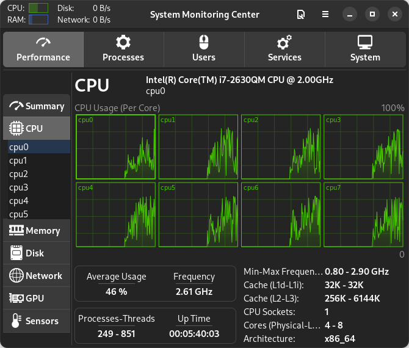
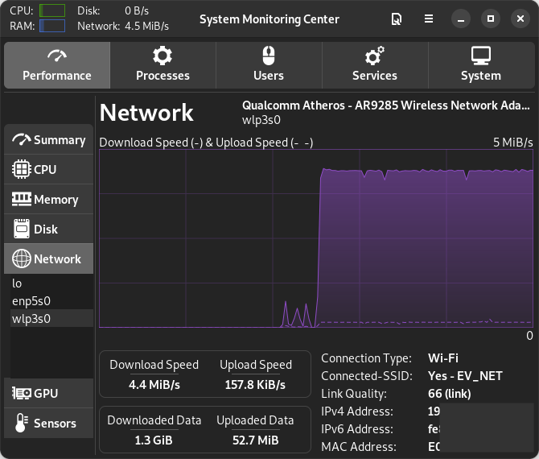
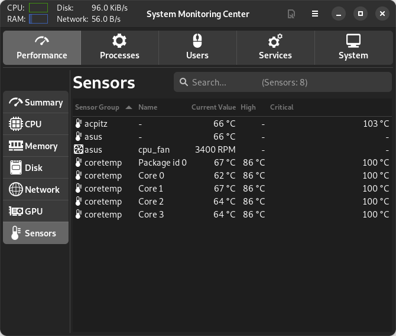

# System Monitoring Center

GTK3 and Python 3 based, system performance and usage monitoring tool.


<p align="center">
<a href="https://github.com/hakandundar34coding/system-monitoring-center/releases">
</a>
<a href="https://github.com/hakandundar34coding/system-monitoring-center/releases"></a>
</a>
<a href="https://github.com/hakandundar34coding/system-monitoring-center/releases"></a>
</a>
<a href="https://github.com/hakandundar34coding/system-monitoring-center/releases"></a>
</a>
</p>


<a href="https://github.com/hakandundar34coding/system-monitoring-center/releases"></a>
</a>

<a href="https://repology.org/project/system-monitoring-center/versions">
    
</a>

### Generating Packages From Source Code:
```
1) Download the source code
2) Browse /packaging_scripts folder
3) Open terminal in this folder
4) Run the required script without "sudo"
   For DEB package:
      sh debian_packaging.sh
   For RPM package:
      sh rpm_packaging.sh
   For PACMAN package:
      sh arch_linux_packaging.sh

Note: If there are dependency problems during installation:
      1) Install the dependencies 
      2) Install the application
```

### Features:
* Detailed system performance and usage usage monitoring/managing features:
    * Monitoring CPU, RAM, Disk, Network, GPU hardware information/performance/usage
    * An always on top and semi-transparent floating summary window for performance monitoring
    * Monitoring and managing processes, users, startup applications and services (systemd)
    * Monitoring sensors and general system information
* Language support:
    * Brazilian Portuguese, Czech, English, Polish (initial), Turkish
    * More languages will be added if translations are provided by contributors
* Adapts to system theme
* Free and open sourced










### Note:
* A simple FPS counter is shown on the GPU tab and may not be accurate in some situations.
* FPS counting does not continue when window is minimized.

