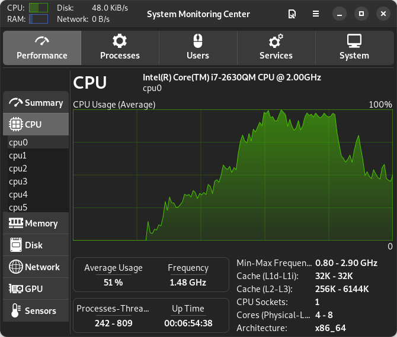

# System Monitoring Center

GTK3 and Python 3 based, system performance and usage monitoring tool.


<p align="center">
<a href="https://github.com/hakandundar34coding/system-monitoring-center/tags"></a>
<a href="https://github.com/hakandundar34coding/system-monitoring-center/tags"></a>
<a href="https://github.com/hakandundar34coding/system-monitoring-center/tags"></a>
<a href="https://github.com/hakandundar34coding/system-monitoring-center/tags"></a>
<a href="https://github.com/hakandundar34coding/system-monitoring-center/tags"></a>
<a href="https://pypi.org/project/system-monitoring-center/"></a>
<a href="https://github.com/hakandundar34coding/system-monitoring-center/blob/master/Changes.md"></a>
</p>


### Installation:
* System Monitoring Center is installable from PyPI as a Python package.
* Remove older versions (v1.8.0 and older).
* Install this dependency: ```mesa-utils (on some systems: glx-utils)```
* Option-1) Installing for current user account: ```pip install system-monitoring-center```
* Option-2) Installing for system-wide: ```sudo pip install system-monitoring-center```
  (This method can be used for preventing source code modifications.)
* First run:
  Run the application by using ```system-monitoring-center``` command.
  The application will prepare shortcut and GUI images automatically.
  If command is not found, restart the system and run the command again.


------------------

These dependencies are already installed on many systems:
```bash (>=4.4), dmidecode, iproute2, python3 (>=3.6), python3-cairo, python3-gi, python3-gi-cairo, util-linux (>=2.31)```

------------------


### Features:
* Detailed system performance and usage usage monitoring/managing features:
    * Monitoring CPU, RAM, Disk, Network, GPU hardware information/performance/usage
    * An always on top and semi-transparent floating summary window for performance monitoring
    * Monitoring and managing processes, users, startup applications and services (systemd)
    * Monitoring sensors and general system information
* Language support:
    * Brazilian Portuguese, Czech, English, Polish (initial), Turkish
    * More languages will be added if translations are provided by contributors
* Adapts to system theme
* Optimized for low CPU usage
* Free and open sourced


### Screenshots:



### Note:
* A simple FPS counter is shown on the GPU tab and may not be accurate in some situations.
* FPS counting does not continue when window is minimized.

* Some virtual machines does not provide CPU min-max frequencies, sensors and RAM hardware information.
